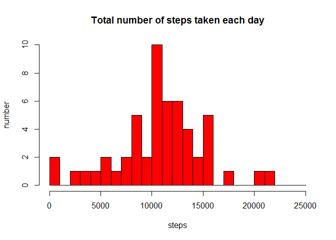

# Reproducible Research: Peer Assessment 1

## Loading and preprocessing the data


```r
unzip("activity.zip")
activity <- read.csv("activity.csv")
summary(activity)
```

```
##      steps                date          interval     
##  Min.   :  0.00   2012-10-01:  288   Min.   :   0.0  
##  1st Qu.:  0.00   2012-10-02:  288   1st Qu.: 588.8  
##  Median :  0.00   2012-10-03:  288   Median :1177.5  
##  Mean   : 37.38   2012-10-04:  288   Mean   :1177.5  
##  3rd Qu.: 12.00   2012-10-05:  288   3rd Qu.:1766.2  
##  Max.   :806.00   2012-10-06:  288   Max.   :2355.0  
##  NA's   :2304     (Other)   :15840
```

## What is mean total number of steps taken per day?

1. Calculate the total number of steps taken per day.
2. Make a histogram of the total number of steps taken each day.


```r
# remove NA
#tmp <- activity[!is.na(activity$steps),]
sum.steps <- aggregate(activity$steps, by=list(activity$date), FUN=sum, na.exclude=TRUE)
hist(sum.steps$x, breaks=seq(0,25000,1000), main="Total number of steps taken each day", xlab="steps", ylab="number", col="red")
```

 

3. Calculate and report the mean and median of the total number of steps taken per day:


```r
mean(sum.steps$x, na.rm=TRUE)
```

```
## [1] 10767.19
```

```r
median(sum.steps$x, na.rm=TRUE)
```

```
## [1] 10766
```

## What is the average daily activity pattern?

1. Make a time series plot (i.e. type = "l") of the 5-minute interval (x-axis) and the average number of steps taken, averaged across all days (y-axis)


```r
avg.steps <- aggregate(steps ~ interval, data=activity, FUN=mean, na.exclude=TRUE)
plot(avg.steps, type="l", xlab="5 minute interval", ylab="average number of steps")
```

 

2. Which 5-minute interval, on average across all the days in the dataset, contains the maximum number of steps?


```r
avg.steps$interval[which.max(avg.steps$steps)]
```

```
## [1] 835
```

## Imputing missing values

1. Calculate and report the total number of missing values in the dataset (i.e. the total number of rows with NAs)


```r
sum(is.na(activity$steps))
```

```
## [1] 2304
```

2. Devise a strategy for filling in all of the missing values in the dataset. The strategy does not need to be sophisticated. For example, you could use the mean/median for that day, or the mean for that 5-minute interval, etc.

Let's use [mean / count of daily intervals] for missing values

3. Create a new dataset that is equal to the original dataset but with the missing data filled in.


```r
filled_activity <- activity
# Find count of 5-minutes intervals per day (24 * (60 min/ 5 min))
cnt <- 24 * 60 / 5
filled_activity$steps[is.na(filled_activity$steps)] <- mean(sum.steps$x, na.rm=TRUE) / cnt

# Check if we have zero NA values
sum(is.na(filled_activity$steps))
```

```
## [1] 0
```

4. Make a histogram of the total number of steps taken each day and Calculate and report the mean and median total number of steps taken per day. Do these values differ from the estimates from the first part of the assignment? What is the impact of imputing missing data on the estimates of the total daily number of steps?


```r
filled_sum.steps <- aggregate(filled_activity$steps, by=list(filled_activity$date), FUN=sum)
hist(filled_sum.steps$x, breaks=seq(0,25000,1000), main="Total number of steps taken each day (NA eliminated)", xlab="steps", ylab="number", col="red")
```

 


```r
mean(filled_sum.steps$x)
```

```
## [1] 10766.32
```

```r
median(filled_sum.steps$x)
```

```
## [1] 10767.19
```

Mean and median are changed a little after we took exactly mean values for the missing values. If we took other values mean and median could be changed more. Histogram is changed a bit, too, but its shape remains the same.


## Are there differences in activity patterns between weekdays and weekends?

1. Create a new factor variable in the dataset with two levels – “weekday” and “weekend” indicating whether a given date is a weekday or weekend day.


```r
# as my locale is not English and I suppose someone's other could be not English too
Sys.setlocale("LC_TIME", "English")
```

```
## [1] "English_United States.1252"
```

```r
filled_activity$day <- "weekday"
filled_activity$day[weekdays(as.Date(filled_activity$date), abbreviate=TRUE) %in% c("Sat","Sun")] <- "weekend"
```

2. Make a panel plot containing a time series plot (i.e. type = "l") of the 5-minute interval (x-axis) and the average number of steps taken, averaged across all weekday days or weekend days (y-axis). See the README file in the GitHub repository to see an example of what this plot should look like using simulated data.


```r
# warning suppressed to eliminate warning about version of ggplot2
filled_avg.steps <- aggregate(steps ~ interval + day, data=filled_activity, FUN=mean, na.exclude=TRUE)

# to make a good 2-parts plot
library(ggplot2)
qplot(interval, steps, data=filled_avg.steps, geom=c("line"),  ylab="Number of steps", xlab="5 min intervals", main="Average 5 min activity intervals: Weekdays vs. Weekends") + facet_wrap(~ day, ncol = 1)
```

 
